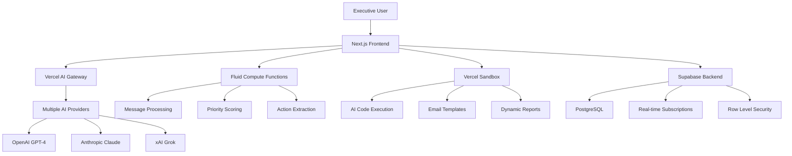

# Napoleon AI - Vercel AI Cloud Environment Setup Guide

## Executive Summary

This guide provides comprehensive setup documentation for deploying Napoleon AI on Vercel's AI Cloud platform, leveraging AI Gateway, Fluid compute, and Sandbox for enterprise-grade executive communication management.

## Table of Contents
1. [Environment Architecture Overview](#environment-architecture-overview)
2. [AI Gateway Configuration](#ai-gateway-configuration)
3. [Fluid Compute Setup](#fluid-compute-setup)
4. [Sandbox Integration](#sandbox-integration)
5. [Development to Production Pipeline](#development-to-production-pipeline)
6. [Monitoring & Observability](#monitoring--observability)
7. [Security Configuration](#security-configuration)
8. [Performance Optimization](#performance-optimization)
9. [Deployment Scripts](#deployment-scripts)

---

## Environment Architecture Overview

### Platform Transformation
Napoleon AI leverages Vercel's evolution from Frontend Cloud to AI Cloud, positioning the platform for executive-level AI workloads with:

- **Unified AI Model Access**: ~100 AI models through single gateway
- **Zero Vendor Lock-in**: Switch between OpenAI, Anthropic, xAI with one line of code
- **Enterprise Security**: Isolated execution environments for AI-generated code
- **Cost Optimization**: Active CPU pricing with up to 85% cost savings

### Core Infrastructure Components



---

## AI Gateway Configuration

### 1. Gateway Setup

The AI Gateway eliminates API key management and provides unified access to multiple AI providers:

```typescript
// src/lib/ai/vercel-gateway.ts
import { openai } from 'ai/openai';
import { anthropic } from 'ai/anthropic';
import { xai } from 'ai/xai';

export const aiConfig = {
  // Primary model for executive communication
  primary: openai('gpt-4-turbo'),
  
  // Fallback models for high availability
  fallbacks: [
    anthropic('claude-3.5-sonnet'),
    xai('grok-3')
  ],
  
  // Model selection based on task type
  taskModels: {
    summarization: openai('gpt-4-turbo'),
    prioritization: anthropic('claude-3.5-sonnet'),
    sentiment: xai('grok-3'),
    actionExtraction: openai('gpt-4-turbo')
  }
};

// Dynamic model switching
export function getModelForTask(task: string) {
  return aiConfig.taskModels[task] || aiConfig.primary;
}
```

### 2. Environment Variables

```bash
# Vercel AI Gateway (No API keys needed)
VERCEL_AI_GATEWAY_ENABLED=true
VERCEL_PROJECT_ID=your-project-id

# Fallback API keys (Optional - for development/backup)
OPENAI_API_KEY=sk-...
ANTHROPIC_API_KEY=sk-ant-...
XAI_API_KEY=xai-...

# Gateway Configuration
AI_GATEWAY_RATE_LIMIT=1000
AI_GATEWAY_TIMEOUT=30000
AI_GATEWAY_RETRY_COUNT=3
```

### 3. Gateway Implementation

Update the existing AI service to use Vercel AI Gateway:

```typescript
// src/lib/ai/ai-service.ts
import { generateText, generateObject } from 'ai';
import { aiConfig, getModelForTask } from './vercel-gateway';

export class VercelAIService {
  async analyzeMessage(content: string, context: any) {
    try {
      // Use AI Gateway with automatic failover
      const result = await generateObject({
        model: getModelForTask('prioritization'),
        prompt: `Analyze this executive message for priority and sentiment: ${content}`,
        schema: {
          priority: 'number',
          sentiment: 'string',
          urgency: 'string',
          vipStatus: 'boolean'
        }
      });
      
      return result.object;
    } catch (error) {
      // Gateway handles automatic failover to backup models
      console.error('AI analysis failed:', error);
      throw error;
    }
  }

  async generateSummary(messages: any[]) {
    const result = await generateText({
      model: getModelForTask('summarization'),
      prompt: `Create executive summary for ${messages.length} messages`,
      maxTokens: 500
    });
    
    return result.text;
  }
}
```

---

## Fluid Compute Setup

### 1. Configuration

Fluid compute optimizes for AI workloads with shared resources and Active CPU pricing:

```typescript
// vercel.json - Updated for Fluid Compute
{
  "buildCommand": "npm run build",
  "outputDirectory": ".next",
  "framework": "nextjs",
  "regions": ["iad1", "sfo1", "lhr1"],
  "functions": {
    "src/app/api/ai/**/*.ts": {
      "maxDuration": 300,
      "memory": 3008,
      "runtime": "nodejs20.x",
      "fluid": true
    },
    "src/app/api/integrations/**/*.ts": {
      "maxDuration": 180,
      "memory": 1024,
      "runtime": "nodejs20.x",
      "fluid": true
    }
  },
  "compute": {
    "type": "fluid",
    "concurrency": 100,
    "pricing": "active-cpu"
  }
}
```

### 2. Optimized Function Implementation

```typescript
// src/app/api/ai/analyze-batch/route.ts
import { NextRequest, NextResponse } from 'next/server';
import { VercelAIService } from '@/lib/ai/ai-service';

const aiService = new VercelAIService();

export async function POST(request: NextRequest) {
  const { messages } = await request.json();
  
  // Fluid compute enables concurrent processing
  const analyses = await Promise.all(
    messages.map(message => aiService.analyzeMessage(message.content, message))
  );
  
  return NextResponse.json({ analyses });
}

// Edge runtime for maximum performance
export const runtime = 'edge';
export const dynamic = 'force-dynamic';
```

### 3. Cost Optimization Features

- **Active CPU Pricing**: Pay only for compute time used (300ms out of 30s = pay for 300ms)
- **Shared Resources**: Multiple requests share underlying infrastructure
- **Intelligent Scaling**: Automatic scaling based on demand
- **Cold Start Elimination**: Persistent warm instances for AI workloads

---

## Sandbox Integration

### 1. Secure Code Execution Setup

Vercel Sandbox provides isolated environments for AI-generated code:

```typescript
// src/lib/sandbox/vercel-sandbox.ts
import { Sandbox } from '@vercel/sandbox';

export class SecureSandbox {
  private sandbox: Sandbox;

  constructor() {
    this.sandbox = new Sandbox({
      runtime: 'nodejs20',
      timeout: 45000, // 45 minutes max
      memory: '1gb'
    });
  }

  async executeAICode(code: string, context: any) {
    try {
      // Create isolated environment
      const session = await this.sandbox.create();
      
      // Install required packages
      await session.install(['@types/node', 'lodash']);
      
      // Execute untrusted AI-generated code
      const result = await session.execute(code, {
        env: {
          CONTEXT: JSON.stringify(context),
          // No access to production secrets
        }
      });
      
      // Clean up
      await session.destroy();
      
      return result;
    } catch (error) {
      console.error('Sandbox execution failed:', error);
      throw new Error('Code execution failed in secure environment');
    }
  }

  async generateEmailTemplate(prompt: string, data: any) {
    const templateCode = `
      const template = (data) => {
        // AI-generated template logic
        return \`
          <div style="font-family: 'Playfair Display', serif;">
            <h1>Executive Summary for \${data.recipient}</h1>
            <p>\${data.content}</p>
          </div>
        \`;
      };
      
      module.exports = { template };
    `;
    
    return this.executeAICode(templateCode, data);
  }
}
```

### 2. AI Agent Integration

```typescript
// src/lib/ai/secure-agent.ts
import { SecureSandbox } from '@/lib/sandbox/vercel-sandbox';
import { VercelAIService } from './ai-service';

export class SecureAIAgent {
  private sandbox: SecureSandbox;
  private aiService: VercelAIService;

  constructor() {
    this.sandbox = new SecureSandbox();
    this.aiService = new VercelAIService();
  }

  async processExecutiveRequest(request: string) {
    // Generate code using AI
    const generatedCode = await this.aiService.generateCode(request);
    
    // Execute in secure sandbox
    const result = await this.sandbox.executeAICode(generatedCode, {
      userRole: 'executive',
      timestamp: new Date().toISOString()
    });
    
    return result;
  }
}
```

---

## Development to Production Pipeline

### 1. Environment Configuration

```yaml
# .github/workflows/deploy.yml
name: Deploy to Vercel AI Cloud

on:
  push:
    branches: [main, develop]
  pull_request:
    branches: [main]

jobs:
  deploy:
    runs-on: ubuntu-latest
    
    strategy:
      matrix:
        environment: [development, staging, production]
    
    steps:
      - uses: actions/checkout@v4
      
      - name: Setup Node.js
        uses: actions/setup-node@v4
        with:
          node-version: '20'
          cache: 'npm'
      
      - name: Install dependencies
        run: npm ci
      
      - name: Type check
        run: npm run type-check
      
      - name: Build application
        run: npm run build
        env:
          VERCEL_AI_GATEWAY_ENABLED: true
          ENVIRONMENT: ${{ matrix.environment }}
      
      - name: Deploy to Vercel
        uses: vercel/action@v1
        with:
          vercel-token: ${{ secrets.VERCEL_TOKEN }}
          vercel-args: ${{ matrix.environment == 'production' && '--prod' || '' }}
          vercel-org-id: ${{ secrets.VERCEL_ORG_ID }}
          vercel-project-id: ${{ secrets.VERCEL_PROJECT_ID }}
```

### 2. Environment-Specific Configurations

#### Development Environment
```bash
# .env.development
VERCEL_ENV=development
AI_GATEWAY_DEBUG=true
SANDBOX_TIMEOUT=10000
FLUID_COMPUTE_CONCURRENCY=10
```

#### Staging Environment
```bash
# .env.staging
VERCEL_ENV=preview
AI_GATEWAY_DEBUG=false
SANDBOX_TIMEOUT=30000
FLUID_COMPUTE_CONCURRENCY=50
```

#### Production Environment
```bash
# .env.production
VERCEL_ENV=production
AI_GATEWAY_DEBUG=false
SANDBOX_TIMEOUT=45000
FLUID_COMPUTE_CONCURRENCY=100
MONITORING_ENABLED=true
```

---

## Monitoring & Observability

### 1. Vercel Observability Setup

```typescript
// src/lib/monitoring/vercel-observability.ts
import { trace, metrics } from '@vercel/observability';

export class ExecutiveMonitoring {
  @trace('ai-processing')
  static async trackAIRequest(operation: string, duration: number) {
    metrics.increment('ai.requests.total', 1, {
      operation,
      environment: process.env.VERCEL_ENV
    });
    
    metrics.histogram('ai.request.duration', duration, {
      operation,
      environment: process.env.VERCEL_ENV
    });
  }

  @trace('sandbox-execution')
  static async trackSandboxUsage(codeType: string, executionTime: number) {
    metrics.increment('sandbox.executions.total', 1, {
      codeType,
      environment: process.env.VERCEL_ENV
    });
    
    metrics.histogram('sandbox.execution.time', executionTime, {
      codeType
    });
  }

  static async trackExecutiveMetrics(userId: string, action: string) {
    metrics.increment('executive.actions.total', 1, {
      userId: userId.substring(0, 8), // Anonymized
      action,
      timestamp: new Date().toISOString()
    });
  }
}
```

### 2. Performance Monitoring

```typescript
// src/lib/monitoring/performance.ts
export class PerformanceMonitor {
  static async measureAILatency<T>(
    operation: () => Promise<T>,
    operationType: string
  ): Promise<T> {
    const start = Date.now();
    
    try {
      const result = await operation();
      const duration = Date.now() - start;
      
      await ExecutiveMonitoring.trackAIRequest(operationType, duration);
      
      // Alert if latency exceeds executive expectations
      if (duration > 5000) {
        console.warn(`High AI latency detected: ${duration}ms for ${operationType}`);
      }
      
      return result;
    } catch (error) {
      const duration = Date.now() - start;
      
      metrics.increment('ai.requests.errors', 1, {
        operation: operationType,
        error: error.message
      });
      
      throw error;
    }
  }
}
```

---

## Security Configuration

### 1. Enterprise Security Headers

```typescript
// next.config.js - Enhanced Security
const securityHeaders = [
  {
    key: 'Content-Security-Policy',
    value: [
      "default-src 'self'",
      "script-src 'self' 'unsafe-eval' 'unsafe-inline' *.vercel.app *.clerk.com",
      "style-src 'self' 'unsafe-inline' fonts.googleapis.com",
      "font-src 'self' fonts.gstatic.com",
      "img-src 'self' data: blob: *.unsplash.com *.clerk.com",
      "connect-src 'self' *.vercel.app *.clerk.com *.supabase.co wss://*.supabase.co",
      "worker-src 'self' blob:",
      "child-src 'self' blob:",
      "frame-ancestors 'none'",
      "base-uri 'self'",
      "form-action 'self'"
    ].join('; ')
  },
  {
    key: 'X-Content-Type-Options',
    value: 'nosniff'
  },
  {
    key: 'X-Frame-Options',
    value: 'DENY'
  },
  {
    key: 'X-XSS-Protection',
    value: '1; mode=block'
  },
  {
    key: 'Referrer-Policy',
    value: 'strict-origin-when-cross-origin'
  },
  {
    key: 'Permissions-Policy',
    value: 'camera=(), microphone=(), geolocation=(), interest-cohort=()'
  }
];
```

### 2. Sandbox Security Policies

```typescript
// src/lib/security/sandbox-policies.ts
export const sandboxSecurityConfig = {
  // Restrict network access
  network: {
    outbound: ['api.openai.com', '*.supabase.co'],
    inbound: false
  },
  
  // File system restrictions
  filesystem: {
    readonly: true,
    tmpdir: '/tmp/sandbox',
    maxSize: '100MB'
  },
  
  // Resource limits
  resources: {
    memory: '1GB',
    cpu: '1vCPU',
    timeout: 45000,
    processes: 10
  },
  
  // Environment restrictions
  environment: {
    allowedVars: ['NODE_ENV', 'CONTEXT'],
    blockedVars: ['API_KEY', 'SECRET', 'TOKEN']
  }
};
```

---

## Performance Optimization

### 1. AI Gateway Optimization

```typescript
// src/lib/ai/optimized-gateway.ts
export class OptimizedAIGateway {
  private cache = new Map();
  
  async optimizedRequest(prompt: string, options: any) {
    // Cache similar requests
    const cacheKey = this.generateCacheKey(prompt, options);
    
    if (this.cache.has(cacheKey)) {
      return this.cache.get(cacheKey);
    }
    
    // Use fastest available model
    const model = this.selectOptimalModel(options.taskType);
    
    const result = await generateText({
      model,
      prompt,
      maxTokens: options.maxTokens || 500,
      temperature: options.temperature || 0.3
    });
    
    // Cache successful results
    this.cache.set(cacheKey, result);
    
    return result;
  }
  
  private selectOptimalModel(taskType: string) {
    const modelPerformance = {
      'summarization': 'gpt-4-turbo', // Best for summaries
      'prioritization': 'claude-3.5-sonnet', // Best for analysis
      'generation': 'grok-3' // Best for creative tasks
    };
    
    return modelPerformance[taskType] || 'gpt-4-turbo';
  }
}
```

### 2. Fluid Compute Optimization

```json
// vercel.json - Performance Tuning
{
  "functions": {
    "src/app/api/ai/**/*.ts": {
      "maxDuration": 300,
      "memory": 3008,
      "runtime": "nodejs20.x",
      "fluid": true,
      "concurrency": 100
    }
  },
  "regions": ["iad1", "sfo1", "lhr1"],
  "framework": "nextjs",
  "buildCommand": "npm run build",
  "installCommand": "npm ci --production=false"
}
```

---

## Deployment Scripts

### 1. Automated Deployment Script

```bash
#!/bin/bash
# scripts/deploy-ai-cloud.sh

set -e

echo "🚀 Deploying Napoleon AI to Vercel AI Cloud..."

# Environment validation
if [ -z "$VERCEL_TOKEN" ]; then
    echo "❌ VERCEL_TOKEN is required"
    exit 1
fi

# Install Vercel CLI
npm install -g vercel@latest

# Login to Vercel
vercel login --token $VERCEL_TOKEN

# Build and deploy
echo "📦 Building application..."
npm run build

echo "🔄 Deploying to staging..."
vercel deploy --token $VERCEL_TOKEN

echo "✅ Staging deployment complete!"

# Production deployment (requires manual confirmation)
read -p "Deploy to production? (y/N): " -n 1 -r
echo
if [[ $REPLY =~ ^[Yy]$ ]]; then
    echo "🚀 Deploying to production..."
    vercel deploy --prod --token $VERCEL_TOKEN
    echo "✅ Production deployment complete!"
fi

echo "🎉 Deployment finished successfully!"
```

### 2. Environment Setup Script

```bash
#!/bin/bash
# scripts/setup-vercel-env.sh

# Setup Vercel environment variables
vercel env add VERCEL_AI_GATEWAY_ENABLED production
vercel env add FLUID_COMPUTE_ENABLED production
vercel env add SANDBOX_ENABLED production

# Add Supabase configuration
vercel env add NEXT_PUBLIC_SUPABASE_URL production
vercel env add SUPABASE_SERVICE_ROLE_KEY production

# Add monitoring configuration
vercel env add MONITORING_ENABLED production
vercel env add PERFORMANCE_TRACKING production

echo "✅ Vercel environment variables configured!"
```

---

## Executive Success Metrics

### 1. Performance Targets

- **AI Response Time**: < 2 seconds for priority scoring
- **Gateway Latency**: < 200ms for model switching
- **Sandbox Execution**: < 5 seconds for code generation
- **Overall Page Load**: < 1.5 seconds for executive dashboard

### 2. Cost Optimization

- **Active CPU Pricing**: 60-85% cost reduction vs traditional serverless
- **Gateway Efficiency**: No API key management overhead
- **Resource Sharing**: Optimal utilization through Fluid compute

### 3. Security Compliance

- **Isolated Execution**: All AI-generated code runs in Sandbox
- **Zero Data Leakage**: No production secrets in sandbox environments
- **Enterprise Headers**: Full CSP and security header implementation

---

## Conclusion

This Vercel AI Cloud setup transforms Napoleon AI into an enterprise-grade platform that executives can trust with their most sensitive communications. The combination of AI Gateway, Fluid compute, and Sandbox provides unmatched performance, security, and cost efficiency for luxury productivity applications.

The architecture ensures:
- **Immediate Value**: Sub-2-second AI processing for executive decisions
- **Enterprise Security**: Isolated execution with no data exposure
- **Cost Efficiency**: Active CPU pricing with significant cost savings
- **High Availability**: Automatic failover across multiple AI providers
- **Scalability**: Fluid compute handles executive workload spikes seamlessly

Deploy with confidence knowing that this setup meets the highest standards expected by C-suite executives who demand both luxury experience and enterprise-grade reliability.