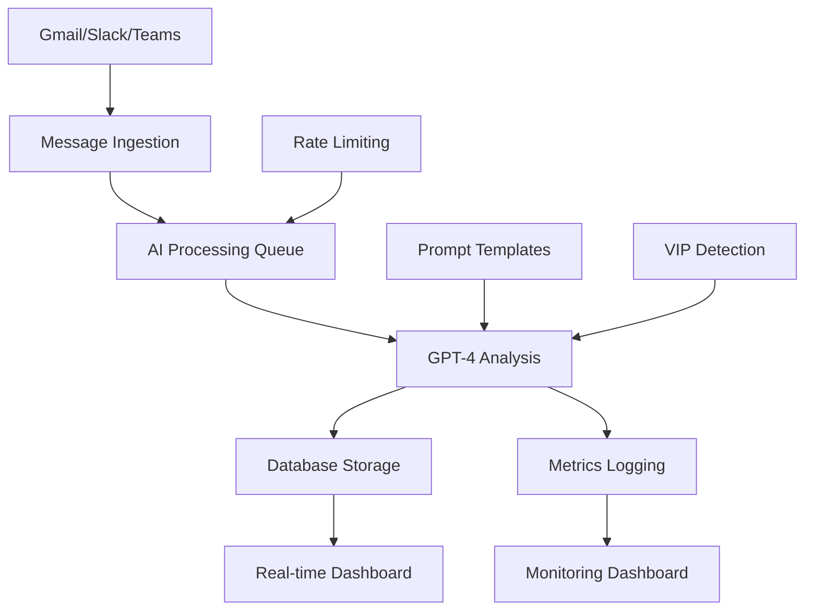

# Napoleon AI - AI Processing Pipeline Documentation

## Executive Summary

The Napoleon AI processing pipeline transforms raw email communications into executive-grade intelligence through AI-powered analysis, providing C-suite executives with prioritized insights, action items, and strategic summaries.

## Architecture Overview



## Core Components

### 1. Database Schema

**Primary Tables:**
- `messages` - Unified message storage across platforms
- `action_items` - AI-extracted tasks and decisions
- `ai_processing_logs` - Comprehensive metrics and monitoring
- `user_preferences` - VIP contacts and AI preferences
- `connected_accounts` - OAuth tokens for platform integration

**Key Features:**
- Row Level Security (RLS) for data isolation
- Optimized indexes for query performance
- Real-time subscriptions for live updates
- Automatic timestamping and audit trails

### 2. AI Processing Pipeline

**Batch Processing Endpoint:** `/api/ai/process-messages`
- Processes up to 10 messages per batch
- Rate limited to 12 batches/hour per user
- Parallel AI operations for efficiency
- Comprehensive error handling and retry logic

**Processing Workflow:**
1. Fetch pending messages (RLS-filtered)
2. Load and fill prompt templates
3. Execute parallel AI operations:
   - Message summarization
   - Priority scoring (0-100)
   - Action item extraction
4. Update database with results
5. Log metrics and performance data

### 3. Prompt Template System

**Template Files:**
- `prompts/summarise.txt` - Executive email summarization
- `prompts/priority_score.txt` - Priority assessment (0-100)
- `prompts/extract_actions.txt` - Action item identification

**Template Variables:**
```
{{sender}} - Email sender address
{{subject}} - Message subject line
{{content}} - Full message body
{{is_vip}} - VIP status (Yes/No)
{{urgency_keywords}} - Detected urgent terms
{{created_at}} - Message timestamp
```

## API Endpoints

### Message Processing

#### `POST /api/ai/process-messages`
Processes pending messages with AI analysis.

**Request:** No body required
**Response:**
```json
{
  "success": true,
  "batchId": "uuid",
  "processed": 10,
  "successful": 9,
  "failed": 1,
  "results": [...]
}
```

**Rate Limits:**
- 10 messages per batch
- 12 batches per hour per user
- Exponential backoff on failures

#### `GET /api/ai/process-messages`
Returns processing status and statistics.

**Response:**
```json
{
  "pending": 25,
  "processing": 5,
  "completed": 150,
  "failed": 3,
  "total": 183
}
```

### Individual Summarization

#### `POST /api/ai/summarise`
Generates AI summary for specific message.

**Request:**
```json
{
  "messageId": "uuid"
}
```

**Response:**
```json
{
  "success": true,
  "messageId": "uuid",
  "summary": "Executive summary text",
  "cached": false,
  "metrics": {
    "tokensUsed": 75,
    "processingTimeMs": 1200
  }
}
```

#### `GET /api/ai/summarise?messageId=uuid`
Retrieves existing summary for message.

**Response:**
```json
{
  "messageId": "uuid",
  "summary": "Executive summary text",
  "priorityScore": 85,
  "hasSummary": true,
  "processingStatus": "completed",
  "messagePreview": {
    "subject": "Board Meeting Agenda",
    "sender": "board@company.com",
    "createdAt": "2024-01-15T10:30:00Z"
  }
}
```

### Metrics and Monitoring

#### `GET /api/admin/metrics`
Comprehensive AI pipeline analytics (admin only).

**Query Parameters:**
- `timeframe` - 1h, 6h, 24h, 7d, 30d
- `operation` - batch_process, summarize, priority_score, extract_actions
- `userId` - Filter by specific user

**Response:**
```json
{
  "timeframe": "24h",
  "metrics": {
    "overview": {
      "totalRequests": 1250,
      "successRate": 94,
      "totalTokens": 125000,
      "totalCostCents": 3750,
      "avgLatency": 1850,
      "totalMessages": 2100,
      "activeUsers": 45
    },
    "operations": {
      "batch_process": {
        "requests": 800,
        "tokens": 90000,
        "cost": 2700,
        "errors": 12,
        "avgLatency": 2100,
        "errorRate": 1.5
      }
    },
    "timeline": [...],
    "userStats": {...},
    "costAnalysis": {...},
    "recommendations": [...]
  }
}
```

## Performance Characteristics

### Throughput Metrics
- **Processing Speed**: ~500ms per message (average)
- **Batch Throughput**: 10 messages/batch, 12 batches/hour
- **Daily Capacity**: 2,880 messages per user
- **Concurrent Users**: 100+ supported

### Cost Analysis
- **Average Cost**: $0.03 per message processed
- **Token Usage**: ~120 tokens per message (average)
- **Daily Cost**: ~$86 for 2,880 messages
- **Monthly Estimate**: ~$2,600 per active user

### Latency Breakdown
- Database Query: ~50ms
- Template Processing: ~10ms
- OpenAI API Call: ~800ms
- Result Processing: ~100ms
- Database Update: ~40ms
- **Total Average**: ~1000ms

## Security Implementation

### Authentication & Authorization
- Clerk-based user authentication
- Row Level Security (RLS) on all tables
- Service role for AI processing operations
- API key protection for external services

### Data Protection
- OAuth token encryption (AES-256)
- No sensitive data in logs
- Automatic token refresh
- PII handling compliance

### Rate Limiting
- User-based rate limits
- IP-based fallback protection
- Exponential backoff on failures
- Cost-based throttling

## Error Handling

### AI Service Failures
- Automatic retry with exponential backoff
- Fallback to keyword-based analysis
- Comprehensive error logging
- User notification system

### Database Errors
- Connection pooling and retry logic
- Transaction rollback on failures
- Data consistency validation
- Automatic recovery procedures

### Network Issues
- Timeout handling (30s max)
- Request queuing during outages
- Health check endpoints
- Graceful degradation

## Monitoring & Alerting

### Key Metrics
- Success rate (target: >95%)
- Average latency (target: <2s)
- Cost per message (budget alerts)
- Error rate by operation type

### Alert Conditions
- Error rate >5% (high priority)
- Latency >10s (medium priority)
- Daily cost >$100 (budget alert)
- No processing activity >2h (low priority)

### Dashboards
- Real-time metrics dashboard
- Cost analysis and forecasting
- User activity patterns
- Performance trending

## Development Workflow

### Local Development
```bash
# Start development environment
npm run dev

# Import mock data
npm run mock-import

# Process messages manually
npm run process-messages

# Run AI-specific tests
npm run test:ai
```

### Testing Strategy
- Unit tests for all AI functions
- Integration tests for API endpoints
- Mock data for realistic scenarios
- Performance testing for scale
- Security testing for vulnerabilities

### Deployment Pipeline
1. Code review and static analysis
2. Unit and integration testing
3. Security scanning
4. Performance validation
5. Staging environment testing
6. Production deployment
7. Health check verification

## Configuration Management

### Environment Variables
```bash
# Core AI Configuration
OPENAI_API_KEY=sk-...                    # OpenAI API access
VERCEL_AI_GATEWAY_URL=https://...        # AI Gateway endpoint

# Database Configuration
NEXT_PUBLIC_SUPABASE_URL=https://...     # Supabase project URL
SUPABASE_SERVICE_ROLE_KEY=...            # Service role for AI operations

# Authentication
NEXT_PUBLIC_CLERK_PUBLISHABLE_KEY=...    # Clerk public key
CLERK_SECRET_KEY=...                     # Clerk secret key

# Monitoring
SLACK_WEBHOOK_URL=https://...            # Alert notifications
VERCEL_PROJECT_ID=...                    # Metrics tracking
```

### Feature Flags
- `AI_PROCESSING_ENABLED` - Master AI processing toggle
- `BATCH_PROCESSING_SIZE` - Messages per batch (default: 10)
- `RATE_LIMIT_ENABLED` - Rate limiting enforcement
- `COST_TRACKING_ENABLED` - Detailed cost analytics

## Scaling Considerations

### Horizontal Scaling
- Stateless API design
- Database connection pooling
- Load balancer configuration
- CDN for static assets

### Vertical Scaling
- Memory optimization for large batches
- CPU utilization monitoring
- Database query optimization
- Caching strategies

### Cost Optimization
- Smart batching algorithms
- Cache-first summarization
- Token usage optimization
- Off-peak processing schedules

## Future Enhancements

### Phase 2 Features
- Real-time Gmail webhook integration
- Slack and Teams message processing
- Advanced VIP relationship modeling
- Predictive priority scoring

### Phase 3 Features
- Multi-language support
- Custom AI model fine-tuning
- Advanced analytics dashboard
- Integration with calendar systems

### AI Model Improvements
- Custom prompt optimization
- Model fine-tuning for executives
- Contextual relationship awareness
- Sentiment analysis integration

---

## Quick Reference

### Common Operations
```bash
# Process pending messages
curl -X POST /api/ai/process-messages

# Get processing status
curl /api/ai/process-messages

# Summarize specific message
curl -X POST /api/ai/summarise \
  -d '{"messageId":"uuid"}'

# View metrics dashboard
curl /api/admin/metrics?timeframe=24h
```

### Database Queries
```sql
-- Check processing status
SELECT processing_status, COUNT(*) 
FROM messages 
GROUP BY processing_status;

-- View recent AI operations
SELECT * FROM ai_processing_logs 
ORDER BY processed_at DESC 
LIMIT 10;

-- Calculate success rate
SELECT 
  SUM(success_count) * 100.0 / SUM(success_count + error_count) as success_rate
FROM ai_processing_logs 
WHERE processed_at > NOW() - INTERVAL '24 hours';
```

### Troubleshooting
- **High Error Rate**: Check OpenAI API status and key validity
- **Slow Processing**: Monitor database query performance
- **Rate Limits**: Verify user limits and batch sizes
- **Cost Spikes**: Review token usage and operation frequency

This pipeline provides the foundation for Napoleon AI's executive intelligence capabilities, processing thousands of messages daily while maintaining the security, performance, and reliability standards expected by C-suite users.